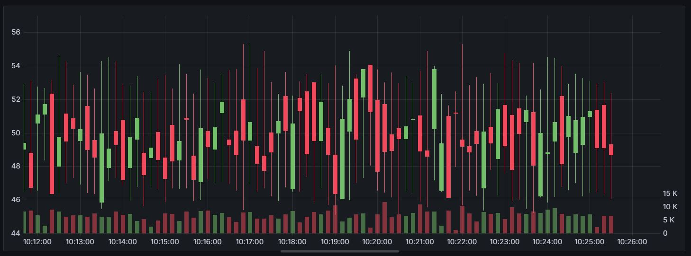
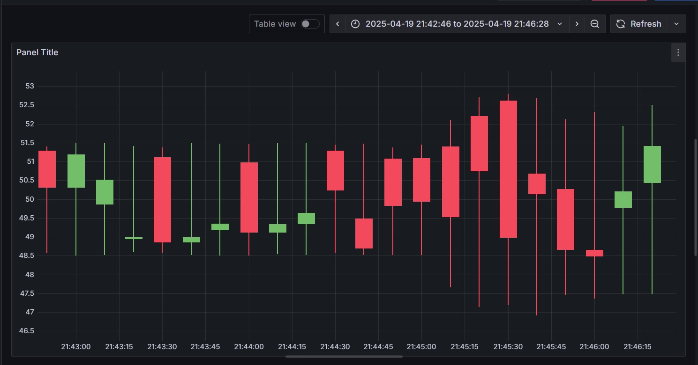

# Real-Time OrderBook Analytics

This repository provides a streaming analytics pipeline using Apache Spark, 
powered by an orderbook data generator from [AdrienLibert/orderbook](https://github.com/AdrienLibert/orderbook). 

The orderbook project data generator was developed in collaboration with [@ShikoteiCoding](https://github.com/ShikoteiCoding).

## Installation

### Dependencies

Install the required dependencies with the following commands:

```
make helm
make build_deps
```

### Start Spark

Launch the spark service:

```
make start
```


### Stop Spark

Stop the spark service:

```
make stop
```

### Candlestick Chart



Created using Grafana, visualizes the price evolution of a financial asset over time. 
Each candlestick displays key data points for a specific time period, including:

Open: The price at the start of the period.

Close: The price at the end of the period.

High: The highest price during the period.

Low: The lowest price during the period.

Volume: The total trading volume during the period.


